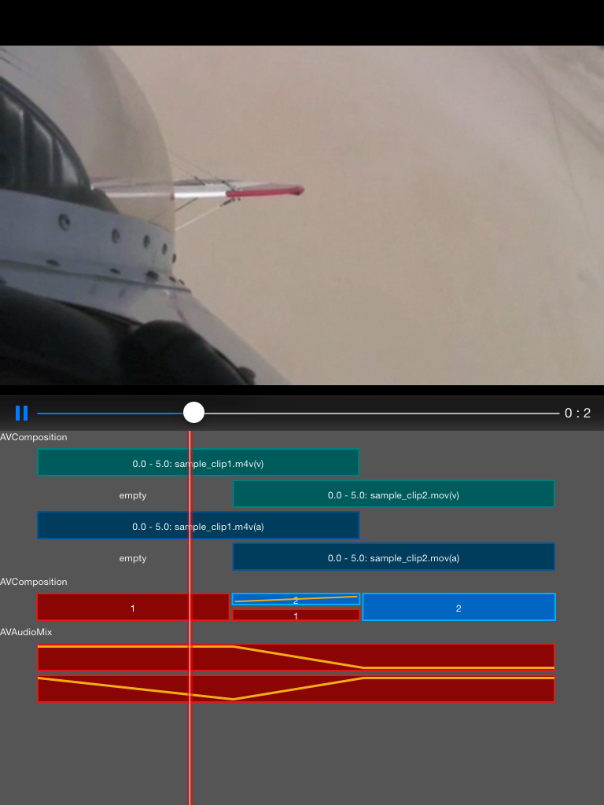

# AVCompositionDebugVieweriOS

This sample application has an AVCompositionDebugView which presents a visual description of the underlying AVComposition, AVVideoComposition and AVAudioMix objects which form the composition made using two clips, adding a cross fade transition in between and audio ramps to the two audio tracks.

## Authors

Oleg Demchenko