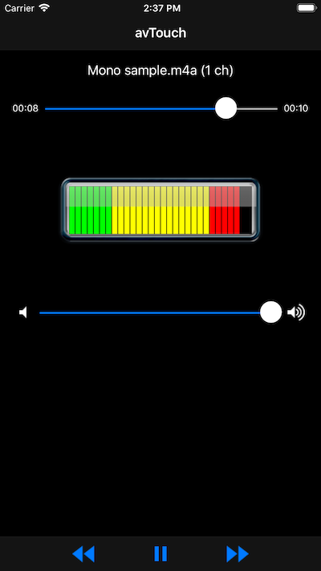

# AV Touch

An example using AVFoundation on iOS devices. This allows a developer to access playing audio and accessing audio data from their application.

## Build Requirements

Xamarin.iOS 7.0, Xcode 5.0 and later

## Related Links

- [Original sample](http://developer.apple.com/library/ios/#samplecode/avTouch/Introduction/Intro.html)

## License

Xamarin port changes are released under the MIT license.
