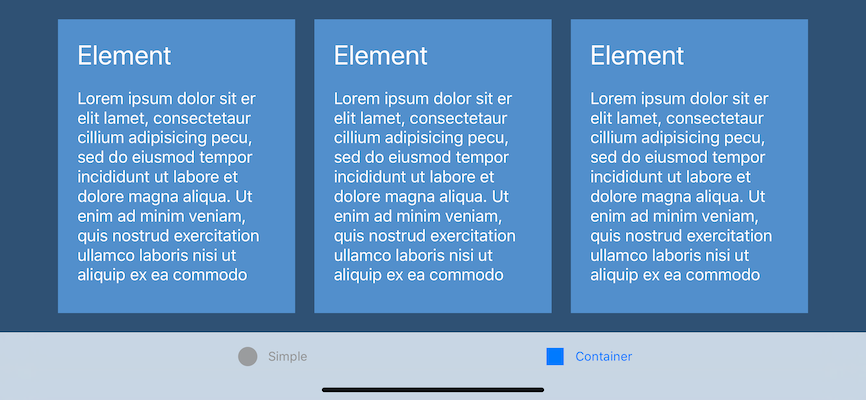

AdaptiveElements: Implementing Your Own Adaptive Design with UIKit
============

This sample shows how to use UIKit to lay out your app's elements in different sizes, from full-screen on the smallest iPhone to Multitasking on the biggest iPad. It shows how to make smart decisions about implementing your own design. It also demonstrates how to reuse elements in different sizes, so you can take advantage of all the available space without having to rewrite your entire app.

Build Requirements
-------

Xamarin.iOS 10.0+ and Xcode 8.0+.

Related Links
-------

- [Original sample](https://developer.apple.com/library/archive/samplecode/AdaptiveElements/Introduction/Intro.html)

License
-------

Xamarin port changes are released under the MIT license.

Author
------

Ported to Xamarin.iOS by Mykyta Bondarenko
