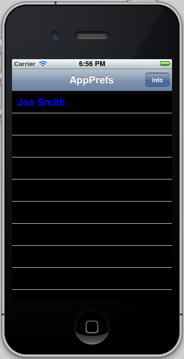

# Application Preferences

An example on how to display application preferences in
the "Settings" system application.

Loosely based on Apple's AppPrefs example:
http://developer.apple.com/library/ios/#samplecode/AppPrefs

