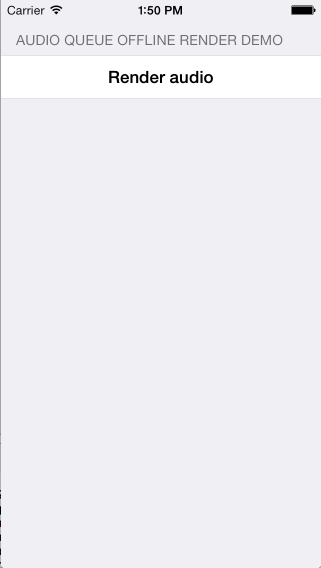

# Audio Queue Offline Render Demo

An example demonstrating the Audio Queue offline rendering API. The sample produces LPCM output
from an mp3 file, which is written to disk as a .caf file then subsequently played back to show
the offline rendering is working as expected.

Based on the Apple sample AQOfflineRenderTest:
http://developer.apple.com/library/ios/#samplecode/AQOfflineRenderTest/Introduction/Intro.html

