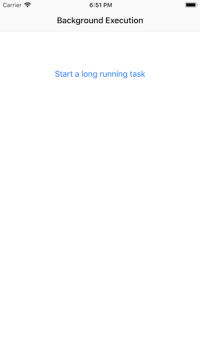

# Background Execution

This sample illustrates how to develop multitasking (background execution) aware applications in Xamarin.iOS. The AppDelegate class illustrates the application lifecycle methods that should be overridden in order to gracefully handle state changes. Additionally, it illustrates how to register a long running task that will finish executing even though the app is put in a background state.

The home screen has a button that will launch a background task that will execute even if the app is backgrounded.

## License

Xamarin port changes are released under the MIT license.
