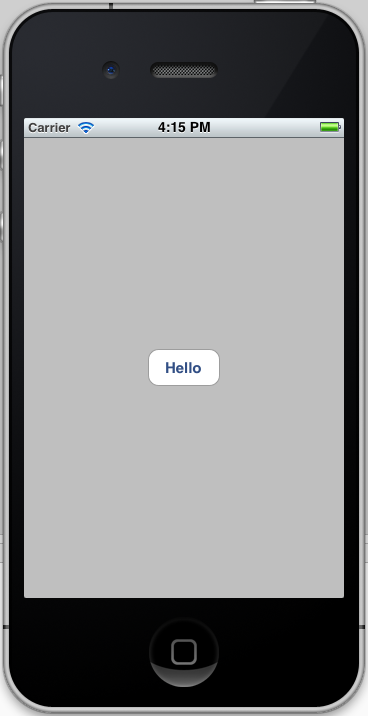

# Button Event Demo

This is a simple example demonstrating how to use a C# event on
a button press to run a callback. It also demonstrates how to do
the same thing, but using code hooked up via Interface Builder.

