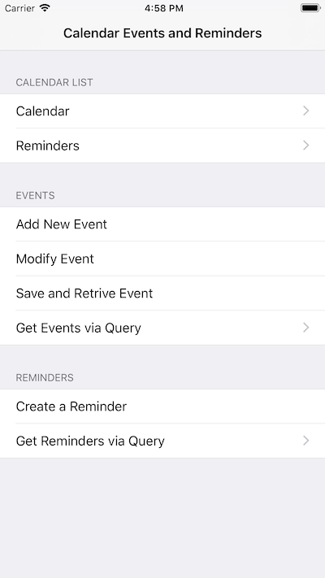

# Calendars and Reminders

Illustrates usage of the EventKit framework including Calendars and Reminders. Shows how to create, retrieve, query, modify, and delete both calendar events and reminders. Additionally, it illustrates how to use the built-in controllers to create and modify calendar events.

## License

Xamarin port changes are released under the MIT license.
