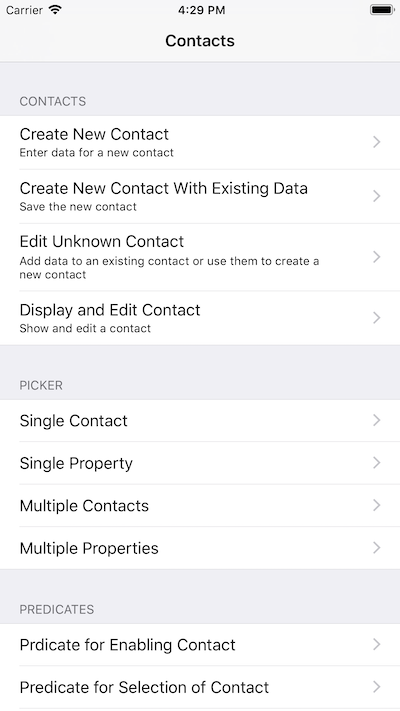

# Contacts: Using ContactsUI View Controllers and Properties

Sample code that demonstrates how to use ContactsUI view controllers and properties.

## Build Requirements

Xcode 9.0 or later; iOS 10.3 SDK or later

## Related Links

- [Original sample](https://developer.apple.com/library/archive/samplecode/ManagingContactsUI/Introduction/Intro.html)
- [Documentation](https://developer.apple.com/documentation/contactsui)

## License

Xamarin port changes are released under the MIT license.
