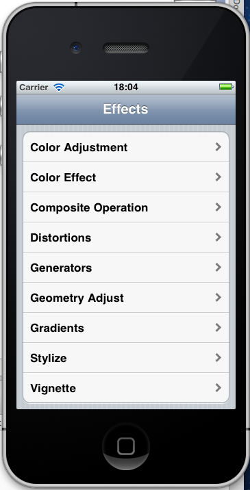

# CoreImage

This sample application demonstrates how to use the image filters found in the CoreImage Library

 

## Images

"Flower" (C) 2012 Milica Sekulic, used under a Creative Commons Attribution-ShareAlike license: http://creativecommons.org/licenses/by-sa/3.0/ 

"Sunrise near Atkeison Plateau" (C) 2012 Charles Atkeison, used under a Creative Commons Attribution-ShareAlike license: http://creativecommons.org/licenses/by-sa/3.0/ 

"canon" (C) 2012 cuatrok77 hernandez, used under a Creative Commons Attribution-ShareAlike license: http://creativecommons.org/licenses/by-sa/3.0/ 
