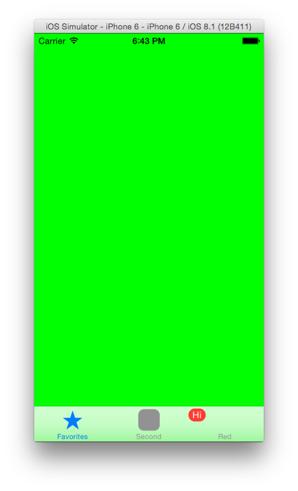

# Creating Tabbed Applications

Two samples showing how tab bars can be used in applications. These are produced in the [Creating Tabbed Applications](/guides/ios/user_interface/creating_tabbed_applications/) guide.

## Authors

Amy Burns
