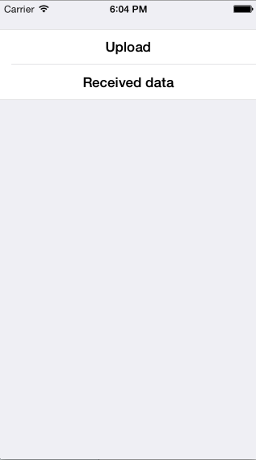

# Custom Input Stream

This sample illustrates how to derive from NSInputStream and create subclass that is toll-free
bridged to CFReadStream that can be used with NSMutableUrlRequest.

Note that the API required to implement a subclass of NSInputStream that is toll-free bridged to
CFReadStream is considered private API by Apple, and may thus cause an app to be rejected
from the AppStore.

This sample requires at least MonoTouch 5.3.4.

## Authors

Rolf Bjarne Kvinge
