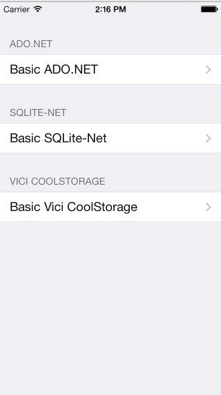

# Data Access

This sample illustrates how use the built in SQLite functionality in iOS. It
illustrates creating a database, adding rows, and querying using the following
three data technologies: ADO.NET and SQLite .NET.

It also outputs performance data of the approaches.

