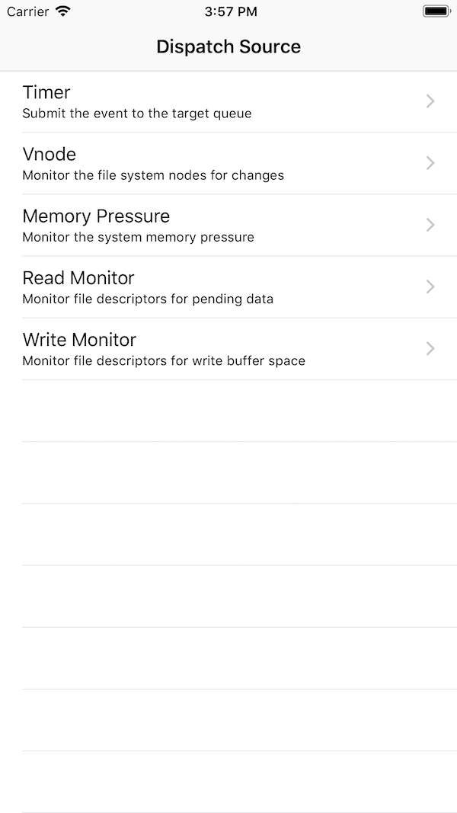

# Dispatch Source Examples

This sample demonstrates how to create and configure different types of Dispatch Sources. Creating a dispatch source involves creating both the source of the events and the dispatch source itself. This sample cover following types of Dispatch Source:

* Timer - periodically submit the event handler block to the target queue.
* Vnode Monitor - monitor the virtual filesystem nodes for state changes.
* MemoryPressure - monitor the system memory pressure condition for state changes. To test this type of source you need to run sample application on iOS simulator and fire memory warning(Hardware -> Simulate Memory Warning).
* WriteMonitor - this type monitor file descriptors for available write buffer space.
* ReadMonitor - monitor file descriptors for pending data.

## License

Code is released under the MIT license
