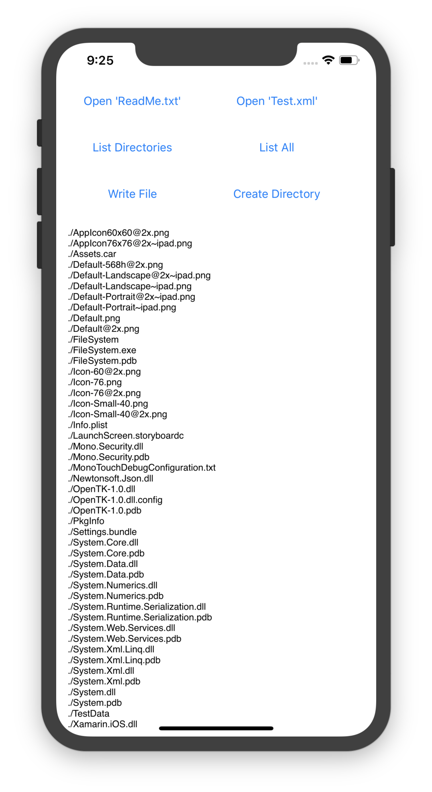

File System on iOS
============

This sample application demonstrates how to use the file system in iOS, as described in the [working with the file system](https://docs.microsoft.com/en-us/xamarin/ios/app-fundamentals/file-system) doc.

Working with the file system in iOS is not unlike working with the file system in .NET from Windows. 
You can still use the System.IO classes that you're used to working with but there
are a few restrictions to be aware of.
Additionally, it’s important to understand the directory structure specific to iOS 
applications in order to know where and when to store things.

iOS 11 also introduced the ability to expose your app's user-directory to other apps and the **Files** app.

