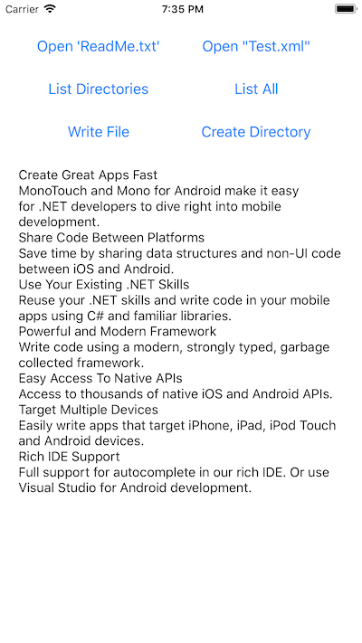

# File System

This sample application demonstrates how to use the file system in iOS, discussed in the [Xamarin.iOS documentation](https://docs.microsoft.com/xamarin/ios/app-fundamentals/file-system).

Working with the file system in iOS is not unlike working with the file system in .NET from Windows.
You can still use the System.IO classes that you're used to working with but there
are a few restrictions to be aware of.
Additionally, it’s important to understand the directory structure specific to iOS
applications in order to know where and when to store things.

## Prerequisites

- [Visual Studio](https://visualstudio.microsoft.com/) on Mac or Windows.
  - _Mobile Development with .NET (Xamarin)_ workload installed.
  - If you're using Windows, there should be a Mac available on the network.
  - Mac computer with the latest version of macOS.
- Latest version of [Xcode](https://developer.apple.com/xcode/) from Apple on the Mac.

## Running the sample

1. Open the solution file (**.sln**) in Visual Studio.
1. Use the **Run** button or menu to start the app.
