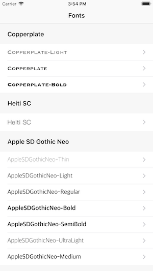

# Font Example

Lists the fonts available on the device and shows a preview of each font.

## Prerequisites

- [Visual Studio](https://visualstudio.microsoft.com/) on Mac or Windows.
  - _Mobile Development with .NET (Xamarin)_ workload installed.
  - If you're using Windows, there should be a Mac available on the network.
  - Mac computer with the latest version of macOS.
- Latest version of [Xcode](https://developer.apple.com/xcode/) from Apple on the Mac.

## Running the sample

1. Open the solution file (**.sln**) in Visual Studio.
1. Use the **Run** button or menu to start the app.

## License

Code is released under the MIT license
