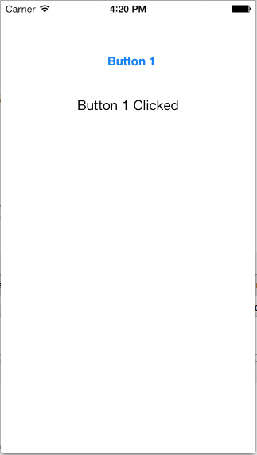

# Hello, Complex Universal

A sample demonstrating how to create universal applications that
will run on both iPhone and iPad devices, by switching the UI based
on the UIInterfaceIdiom enum.

This sample differs from the regular Hello, Universal sample in the
way UI switching is done. Instead of having one controller manage
two separate views depending on the device in use, we employ two
different root controllers.

