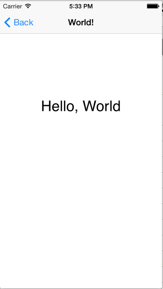

# Hello Multi-Screen iPhone

[Xamarin.iOS samples](https://docs.microsoft.com/en-us/samples/browse/?products=xamarin&term=Xamarin.iOS) | [Xamarin.iOS docs](https://docs.microsoft.com/xamarin/ios/)

This sample serves as an introduction to the primary pattern used
in iOS for user interfaces: MVC (Model-View-Controller). It shows
how to use the UINavigationController class to manage the user
interface of a multi-screen application.

