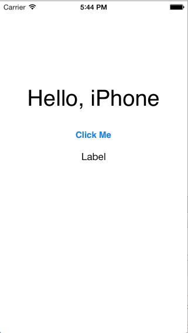

# Hello, Universal App

[Xamarin.iOS samples](https://docs.microsoft.com/en-us/samples/browse/?products=xamarin&term=Xamarin.iOS) | [Xamarin.iOS docs](https://docs.microsoft.com/xamarin/ios/)

A sample demonstrating how to create universal applications that
will run on both iPhone and iPad devices, by switching the UI based
on the `UIInterfaceIdiom` enum.

