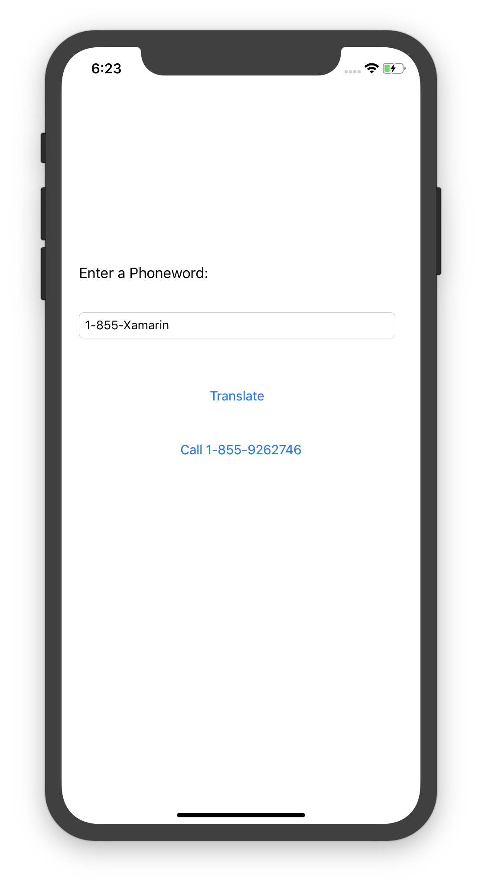

# Hello, iOS

[Xamarin.iOS samples](https://docs.microsoft.com/samples/browse/?products=xamarin&term=Xamarin.iOS) | [Xamarin.iOS docs](https://docs.microsoft.com/xamarin/ios/)

This sample is the application that will be built at the end of the [iOS Get Started](https://docs.microsoft.com/xamarin/ios/get-started/hello-ios/) guides.

There are two seperate folders containing a solution. **Hello.iOS** is the single view application that will be producted at the end of the [Hello, iOS Quickstart](https://docs.microsoft.com/xamarin/ios/get-started/hello-ios/hello-ios-quickstart), and **Hello.iOS_MultiScreen** is the two screen application produced at the end of the [Hello, iOS Multiscreen Quickstart](https://docs.microsoft.com/xamarin/ios/get-started/hello-ios-multiscreen/).

