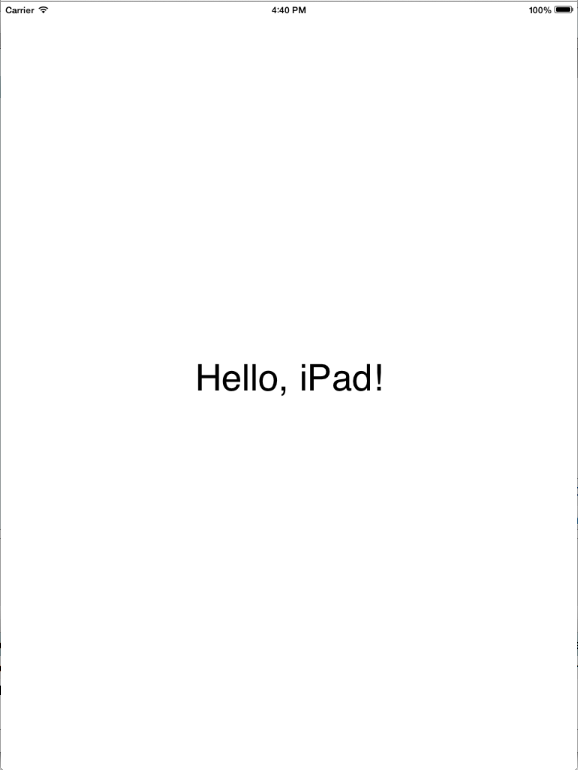

# Hello iPad

[Xamarin.iOS samples](https://docs.microsoft.com/samples/browse/?products=xamarin&term=Xamarin.iOS) | [Xamarin.iOS docs](https://docs.microsoft.com/xamarin/ios/)

This is a simple hello world application demonstrating how to
create, configure, and build applications specific to the iPad.

