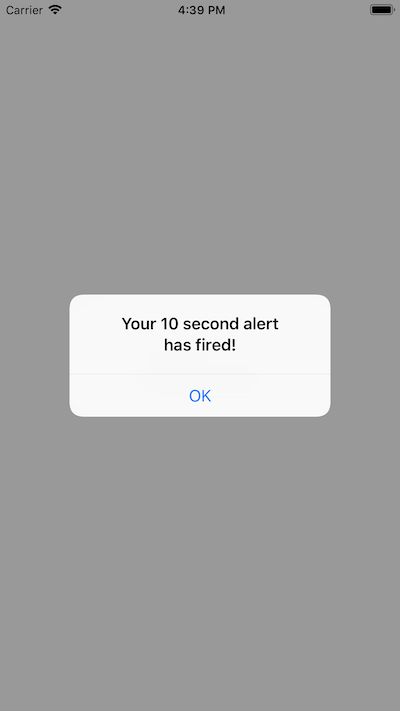

# Local Notifications

This sample illustrates how to schedule and respond to
local notifications.

It related to the [Local Notifications doc](https://docs.microsoft.com/xamarin/ios/platform/user-notifications/deprecated/local-notifications-in-ios) and [walkthrough](https://docs.microsoft.com/xamarin/ios/platform/user-notifications/deprecated/local-notifications-in-ios-walkthrough)

