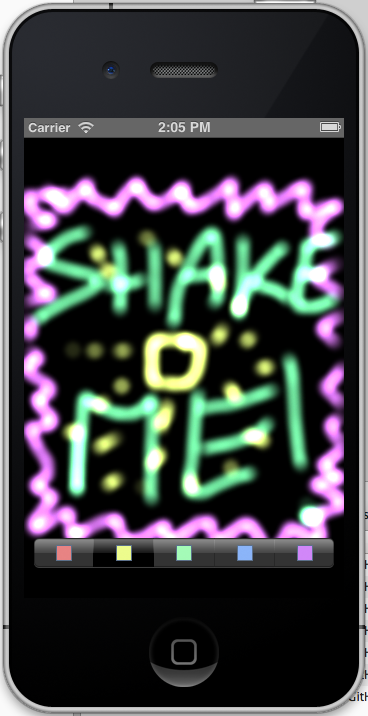

# Low-Level OpenGL Painting

An example on using the low-level OpenGL classes
to create a touch painting application.

Loosely based on Apple's GLPaint example:
http://developer.apple.com/library/ios/#samplecode/GLPaint/Introduction/Intro.html

