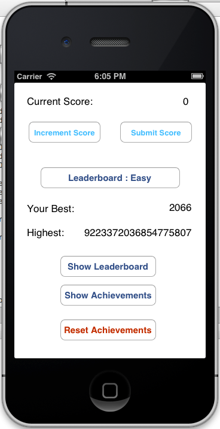

# GameCenterSample

A sample demonstrating how to enable Game Center support in Monotouch.

This sample based on Apple's Game Center example:

https://developer.apple.com/library/ios/samplecode/GKTapper/Introduction/Intro.html#//apple_ref/doc/uid/DTS40010283

## Authors

Bo Pang