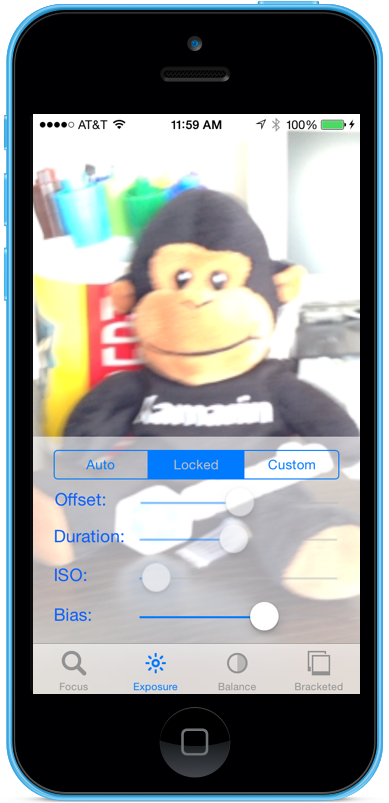

# Manual Camera Controls

The AVFoundation Framework makes it easier than ever for users to take great photos by allowing for Manual Camera Controls. Using this framework, an application can take direct control over the camera focus, white balance, and exposure settings. An application can also use bracketed exposure captures to automatically capture images with different exposure settings. This sample related to the [Introduction to Manual Camera Controls](https://docs.microsoft.com/xamarin/ios/user-interface/controls/intro-to-manual-camera-controls) guide in the developers centre.

