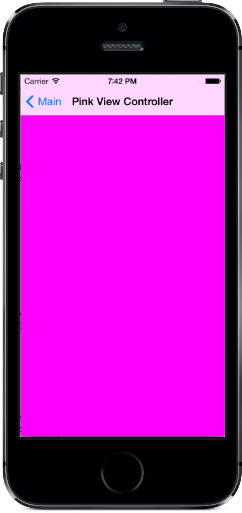

# Manual Storyboard

How to instantiate Storyboards programatically. This is the finished application from the [Instantiate Storyboards Manually](https://docs.microsoft.com/xamarin/ios/user-interface/storyboards/?tabs=macos#Instantiate_Storyboards_Manually) section of the Introduction to Storyboards document.

It also includes a sample detailing how to create conditional segues.

