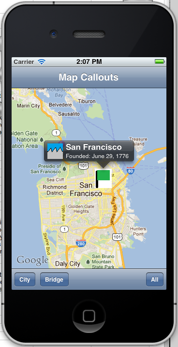

# Map Callouts Demo

An example of how to use the MapKit framework, displaying a map view with a
custom MKAnnotations with custom callouts.

Based on the Apple sample:
http://developer.apple.com/library/ios/#samplecode/MapCallouts/Introduction/Intro.html

## Authors

Rolf Bjarne Kvinge

## License

GoldenGate.jpg: licensed under a Creative Commons Attribute 3.0 Unported license (http://creativecommons.org/licenses/by/3.0/) by freeimageslive / akphoto (http://www.freeimageslive.co.uk/free_stock_image/goldengatebridgejpg)
