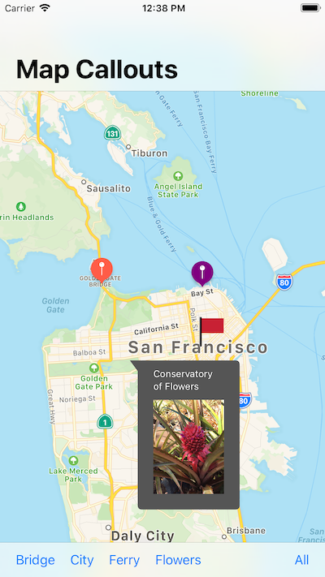

Annotating a Map with Custom Data
=================

This sample code project demonstrates how to display a map with custom annotations, each with a customized callout provided by its [`MKAnnotationView`][1]. In addition, the Map Callouts sample project shows how you can extend annotations with custom views, strings, and callout accessory views using [`MKAnnotation`][2] and [`MKAnnotationView`][1].

[1]:https://developer.apple.com/documentation/mapkit/mkannotationview
[2]:https://developer.apple.com/documentation/mapkit/mkannotation

Build Requirements
-------

Xamarin.iOS 12.0+ and Xcode 10.0+.

Related Links
-------

- [Original sample](https://developer.apple.com/documentation/mapkit/mapkit_annotations/annotating_a_map_with_custom_data)

License
-------

Xamarin port changes are released under the MIT license.

Author
------

Ported to Xamarin.iOS by Rolf Bjarne Kvinge/Mykyta Bondarenko
