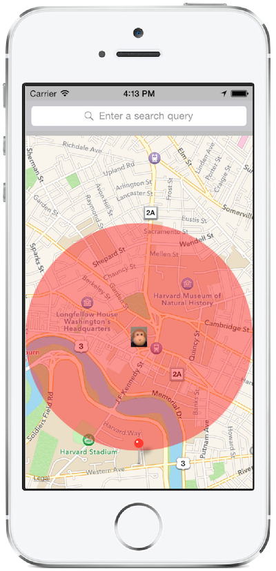

# Xamarin.iOS Map Demo

This sample demonstrates how to use the MapKit framework to display a map
view with a custom annotation. This relates to the [Xamarin.iOS
Maps](https://docs.microsoft.com/xamarin/ios/user-interface/controls/ios-maps/) guide.

