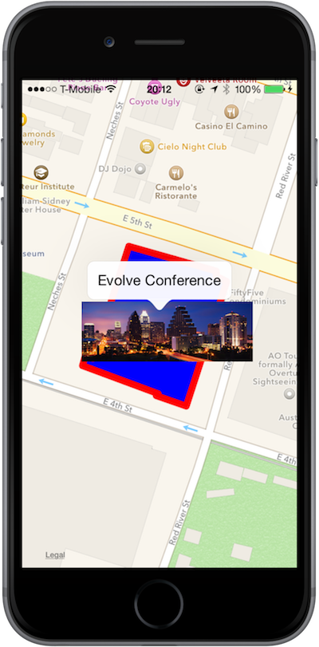

# Xamarin.iOS Maps Walkthrough

Completed sample for the
[Annotations and Overlays in Xamarin.iOS](https://docs.microsoft.com/xamarin/ios/user-interface/controls/ios-maps/ios-maps-walkthrough)
guide, which demonstrates how to add custom map annotations and overlays.

