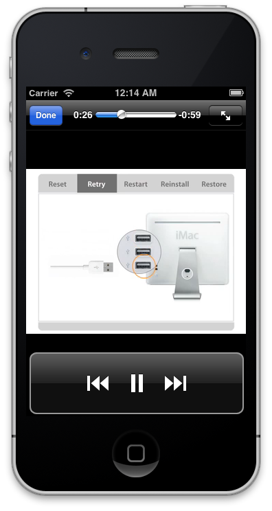

# MoviePlayback

MoviePlayback is an example on how to use the MPMoviePlayerController
class to play any standard movie type that iOS supports.

The example also shows how to enable Airplay for displayed movies from
within your applications.

## Authors

James Bentley
