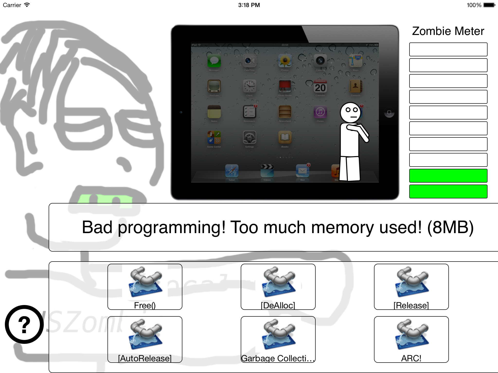

# NSZombieApocalypse
The NSZombieApocalypse is a contrived game that exemplifies how to use the UIAccessibility protocol in order to make an app accessible to VoiceOver users.

## Authors
Ported by Gouri Kumari