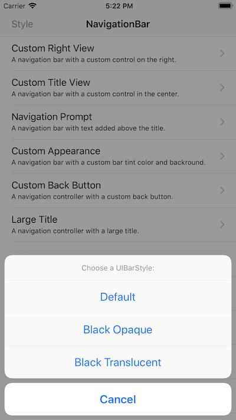

# Customizing UINavigationBar in Xamarin.iOS

This sample demonstrates using `UINavigationController` and `UIViewController` classes together as building blocks to your application's user interface. Use it as a reference when starting the development of your new application. The various pages in this sample exhibit different ways of how to modify the navigation bar directly, using the appearance proxy, and by modifying the view controller's `UINavigationItem`. Among the levels of customization are varying appearance styles, and applying custom left and right buttons known as `UIBarButtonItems`.

## Build Requirements

Xamarin.iOS 11.0 and Xcode 9.4.

## Related Links

- [Original sample](https://developer.apple.com/library/archive/samplecode/NavBar/Introduction/Intro.html)

## License

Xamarin port changes are released under the MIT license.
