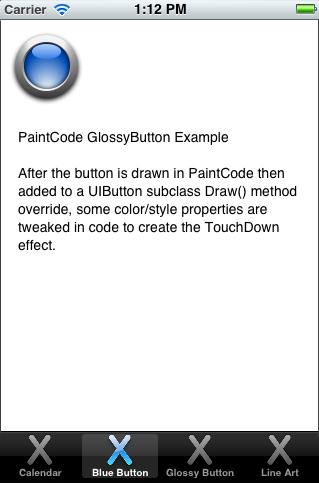
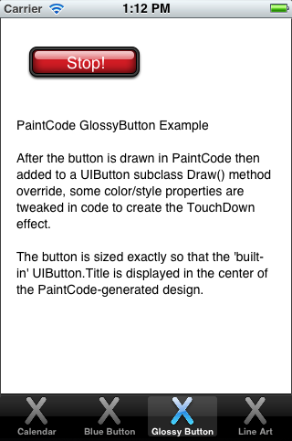

# Xamarin.iOS PaintCode Demo

PaintCode (http://www.paintcodeapp.com) now supports C# code generation for Xamarin.iOS.

This sample app shows some PaintCode-generated elements:

* Calendar badge

* Blue button

* Glossy button

* Random line-art

