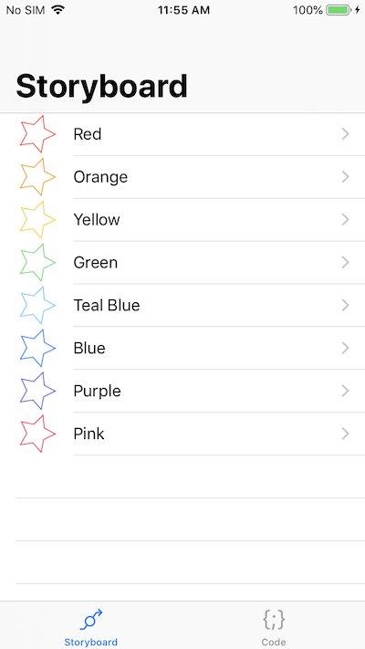

# Implementing Peek and Pop in Xamarin.iOS

This sample project demonstrates previewing content and providing quick shortcuts to functionality using Peek and Pop APIs. The app uses a table view to display a list of colors and tapping any row in the table navigates to a detail view controller showing the color. The app uses 3D Touch on the table view rows to allow users to peek at the content without placing it on the navigation stack.

## Build Requirements

Xamarin.iOS 11.4+ and Xcode 10.0+.

## Related Links

- [Original sample](https://developer.apple.com/documentation/uikit/peek_and_pop/implementing_peek_and_pop)

## License

Xamarin port changes are released under the MIT license.
