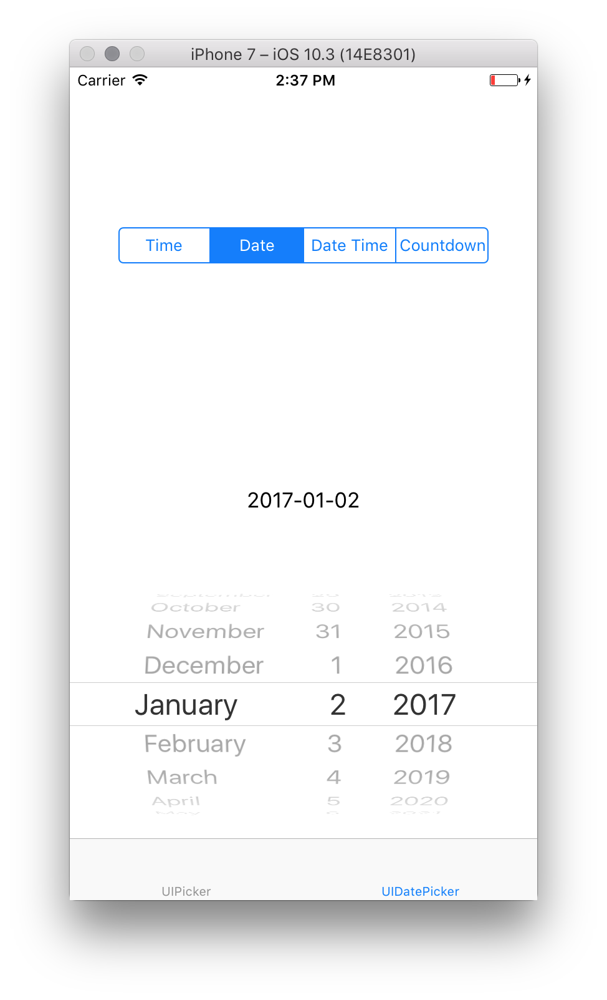

# Picker Controls in Xamarin.iOS

This sample shows how to create and use a `UIPicker` and `UIDatePicker` in Xamarin.iOS. It is the related sample for the [Picker](https://docs.microsoft.com/xamarin/ios/user-interface/controls/picker) guide.

