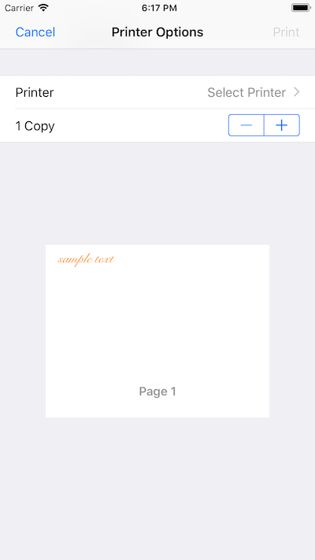

# PrintBanner for Xamarin.iOS

This Sample demonstrates how to print to a roll-fed AirPrint printer.

This sample is a port to apple’s WWDC2013 sample PrintBanner.
Link to Apple’s sample: https://developer.apple.com/downloads/index.action?name=WWDC%202013#

