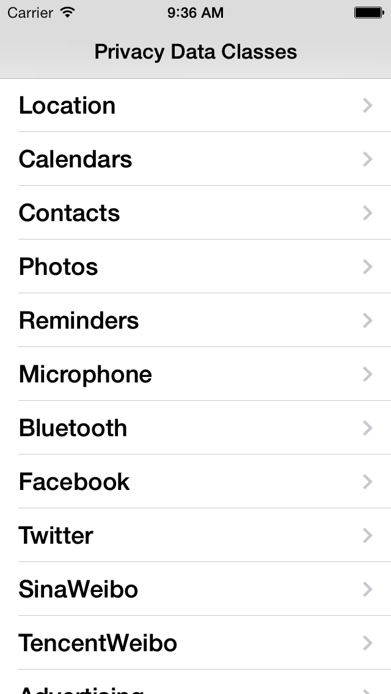

# PrivacyPrompts

This sample demonstrates how to check and request access to classes in the Privacy Settings.



## Notes

This sample does not show how to set and access the following frameworks:

- Health Kit
- Home Kit
- SiriKit

These frameworks will not run on a device without provisioning profiles that contain the correct entitlements. For more information on working with entitlements refer to the [Working with Capabilities](https://docs.microsoft.com/xamarin/ios/deploy-test/provisioning/capabilities/?tabs=windows) guide.

For examples on using privacy settings in these frameworks, refer to the following samples:

- **SiriKit**:
    - [ElizaChat](https://github.com/xamarin/ios-samples/blob/master/ios10/ElizaChat/ElizaChat/AppDelegate.cs#L26-L49)
    - The following Entitlement key must also be set:
        ```
        <key>com.apple.developer.siri</key>
        <true/>
        ```
- **HomeKit**: 
    – [HomeKit app](https://github.com/xamarin/ios-samples/blob/master/HomeKit/HomeKitIntro/HomeKitIntro/AppDelegate.cs)
    - The following Entitlement key must also be set:
        ```
        <key>com.apple.developer.homekit</key>
        <true/>
        ```
- **HealthKit**: 
    – [Intro to HealthKit](https://github.com/xamarin/ios-samples/blob/master/ios8/IntroToHealthKit/HKWork/AppDelegate.cs)
    - The following Entitlement key must also be set:
        ```
        <key>com.apple.developer.healthkit</key>
        <true/>
        ```

## License

Xamarin port changes are released under the MIT license
