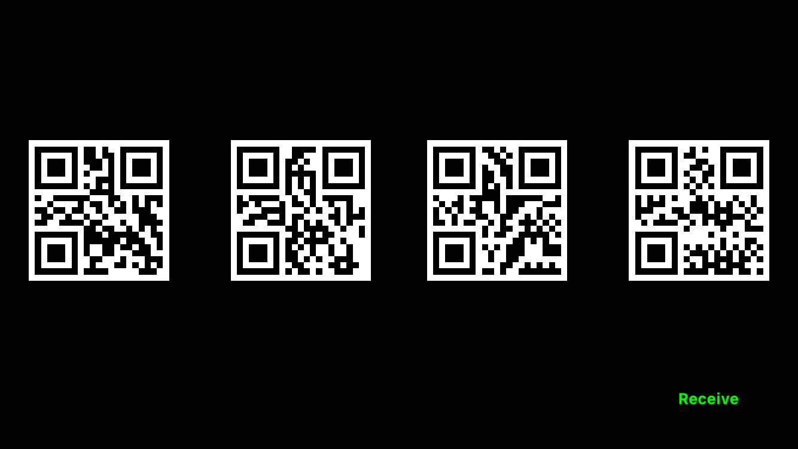

QRchestra
=========

This sample detects QR codes and decodes them.  

If the value of the QR code is a MIDI note number, 
that note is played. Use these QR codes to test (they are generated by the app):




If the value does not qualify as a MIDI note, the QR code is 
highlighted on the screen and the string data from the barcode is 
written to the console, eg:

```
Barcode string data: www.xamarin.com
```

You can generate test QR codes on a number of websites, 
including [this one](http://www.qr-code-generator.com/).

Authors
-------
Timothy Risi