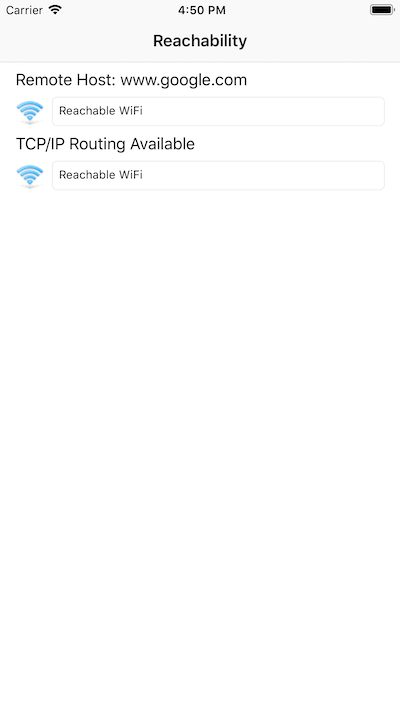

# Reachability Sample

The Reachability sample application demonstrates how to use the System Configuration framework to monitor the network state of an iOS device. In particular, it demonstrates how to know when IP can be routed and when traffic will be routed through a Wireless Wide Area Network (WWAN) interface such as EDGE or 3G.

Note: Reachability cannot tell your application if you can connect to a particular host, only that an interface is available that might allow a connection, and whether that interface is the WWAN. To understand when and how to use Reachability, read [Networking Overview][1].

[1]: <http://developer.apple.com/library/ios/#documentation/NetworkingInternetWeb/Conceptual/NetworkingOverview/>

## Related Links

- [Original sample](https://developer.apple.com/library/archive/samplecode/Reachability/Introduction/Intro.html).
- [Documentation](http://developer.apple.com/library/ios/#documentation/NetworkingInternetWeb/Conceptual/NetworkingOverview/)

## License

Xamarin port changes are released under the MIT license.
