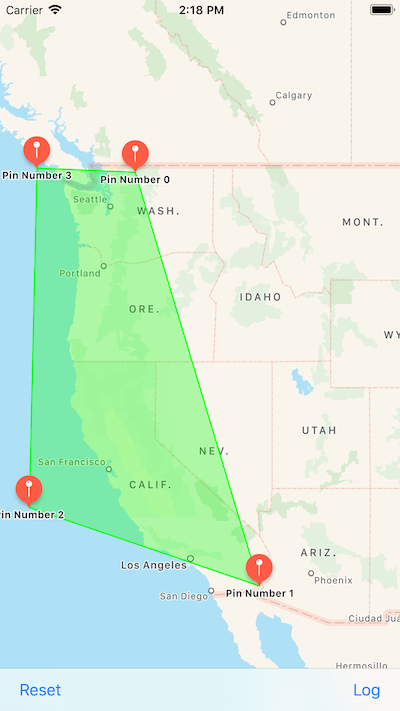

# RegionDefiner

This is a Xamarin.iOS port of the WWDC2012 sample showing how to get around with MapKit.
This sample is an example to generate GeoJSON coverage files for use with the Maps routing apps API.

## License

Xamarin port changes are released under the MIT license.
