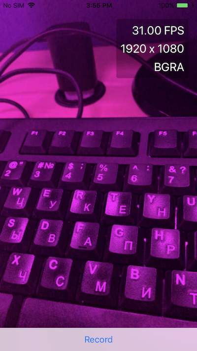

# RosyWriter

This is a port of Apple's RosyWriter sample to C# and MonoTouch.

http://developer.apple.com/library/ios/#samplecode/RosyWriter/Introduction/Intro.html#//apple_ref/doc/uid/DTS40011110

This sample shows how to use AVFoundation to capture video, process
video frames (in this example, we remove the "green" component from
each frame turning images rosy), show the resulting data and
optionally save the resulting video and audio into the user's Photo
storage.

This sample shows multiple parts of iOS in action:

* GLKit to easily setup a GL context, load shaders and render frames.

* AVFoundation to connect to the video camera

* CoreVide's OpenGLTextureCache to directly bind camera frames
  to OpenGL textures

* ALAssets for creating assets.

* Grand Central Dispatch, showing how the main thread uses two
  separate dispatch queues with their own threads to perform
  the CPU intensive "pinkening" and the saving of the data.

