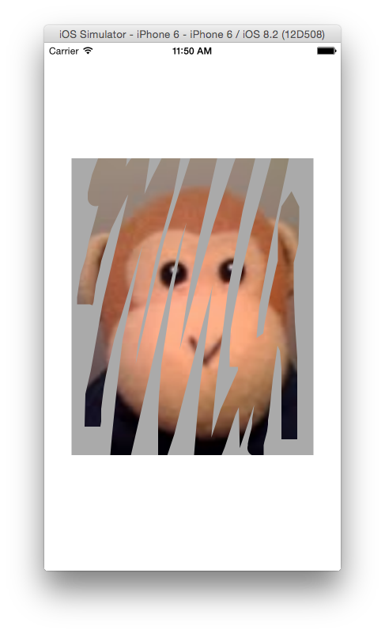

# Scratch Ticket

This sample shows how to create and use a custom component with Xamarin's Designer for iOS. It is the related sample for the walkthrough – [Using Custom Controls with the Xamarin Designer for iOS](https://docs.microsoft.com/xamarin/ios/user-interface/designer/ios-designable-controls-walkthrough).

