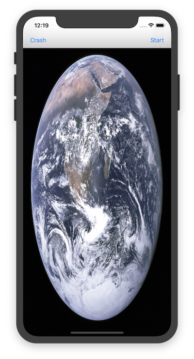

# SimpleBackgroundTransfer

SimpleBackgroundTransfer is a simple app that illustrates how to use background transfers - press the **Start** button to initiate a large image download in the background.

The app must be properly signed to run on the simulator, so ensure that the bundle identifier is correct and your provisioning profiles are configured correctly (otherwise you might see [this issue](https://github.com/xamarin/xamarin-macios/issues/7101)).

This is a port of Apple's [WWDC2013 sample](https://developer.apple.com/downloads/index.action?name=WWDC%202013) SimpleBackgroundTransfer.
