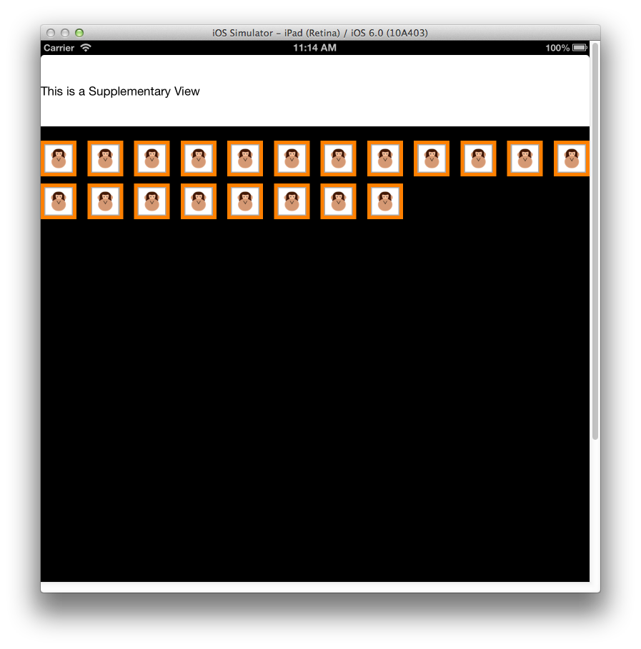

# Simple Collection Views

This sample demonstrates using Collection Views. It accompanies the article [Introduction to Collection Views](https://docs.microsoft.com/xamarin/ios/user-interface/controls/uicollectionview).

