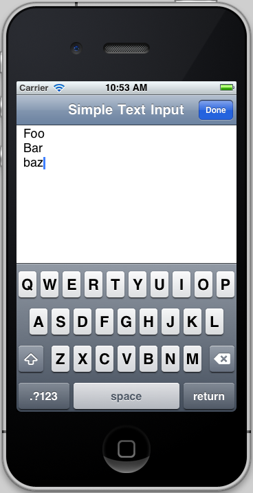

# Simple Text Input Demo

An example showing how to implement a simple text-editing application using Core Text that adopts
various iOS 5 Objective-C protocols in a single class.

It shows how to use the UITextInput and UIKeyInput protocols to connect to the Core Text API.

The file EditableCoreTextView.cs contains a sample showing how to adopt multiple protocols in 
C# using the [Adopts] attribute.

Based on the Apple sample:
http://developer.apple.com/library/ios/#samplecode/SimpleTextInput/Introduction/Intro.html

## Authors

Rolf Bjarne Kvinge
