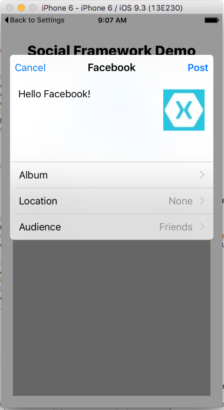

# Social Framework Demo

This sample demonstrates using the Apple's Social Framework to access Twitter and Facebook. It accompanies the article [Introduction to the Social Framework](https://docs.microsoft.com/xamarin/ios/platform/social-framework).

