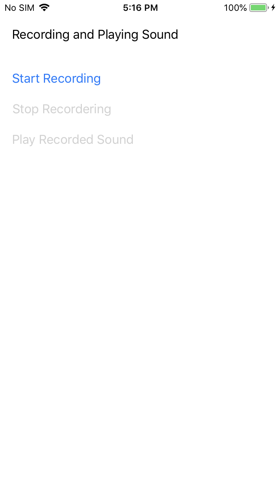

# Sound

Sound is a simple example of how to record an AAC file using the iPhone
microphone or externally attached recording hardware and then play it back.

## Authors

James Bentley, Bryan Costanich
