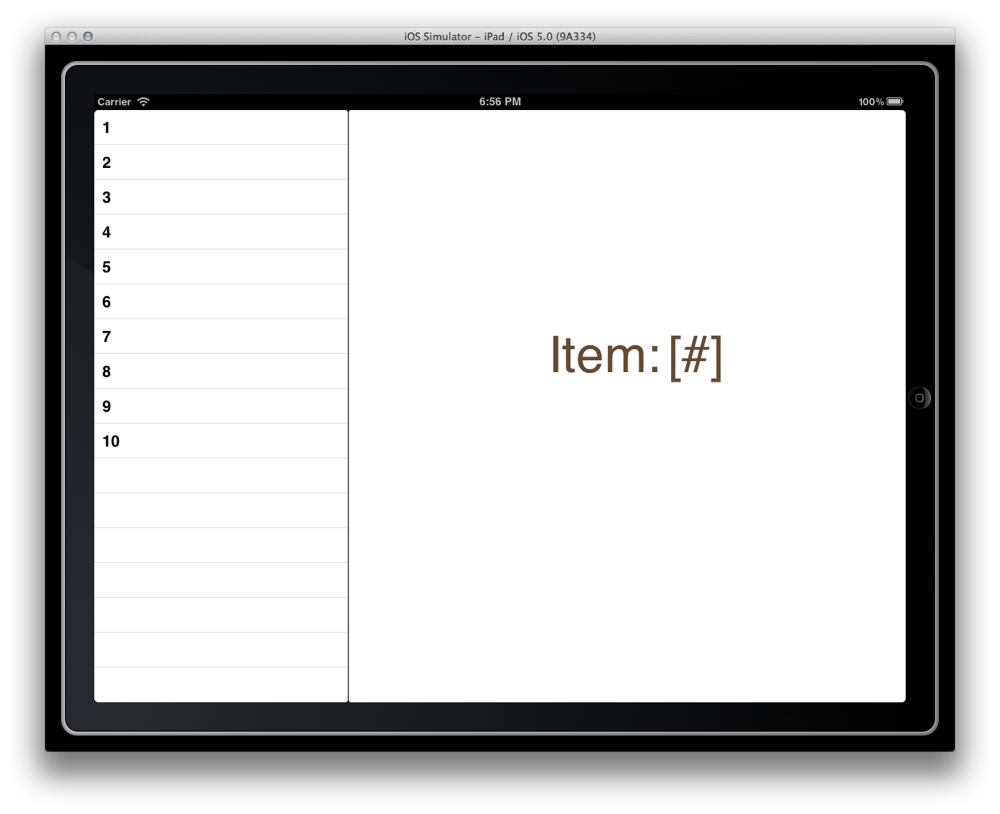

# Split View

This sample illustrates how to use the UISplitView control for iPad. It
utilizes a main split view controller that manages a master view and a set
of child views. When an item on the master view is clicked, it raises and
event that the main split view controller (MainSplitView) listens for and
then notifies the detail view controller accordingly. This pattern should
generally be used when implementing the UISplitViewController because it
decouples the child views from each other and represents an architecturally
resilient design.

## Authors

Bryan Costanich
